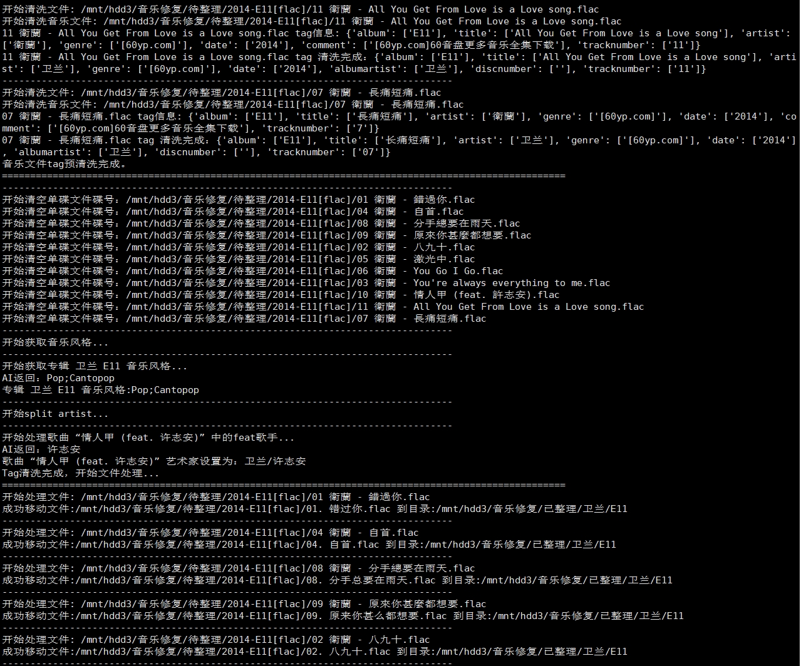

# 音乐 tag 清洗工具  

### 简介

FLAC 、DSF、MP3 音乐 tag 清洗工具。
对音乐文件进行批量操作前，务必复制小部分音乐文件进行小范围测试！！！

### 使用方法

修改`confiy.py`中`SRC_DIR`和`TARGET_DIR`，运行`main.py`脚本进行音乐Tag清洗

### 最佳实践
1. 新建一个音乐清洗目录，包含 `待整理` 和 `已整理` 目录，分别配置在`confiy.py`中的`SRC_DIR` 和 `TARGET_DIR`
2. 将需要清洗的音乐文件放入到 `待整理` 目录中
3. 对于音乐tag缺失的文件使用 [MusicBrainz Picard](https://picard.musicbrainz.org/) 或者 [音乐标签](https://www.cnblogs.com/vinlxc/p/11347744.html) 处理
4. 运行本程序进行音乐tag清洗
5. 将`已整理`目录添加到 [musicbee](https://getmusicbee.com/) 音乐库中。使用 musicbee 处理缺失的音乐封面，找不到的可以用[音乐标签](https://www.cnblogs.com/vinlxc/p/11347744.html)自动获取
6. 使用 [音乐标签](https://www.cnblogs.com/vinlxc/p/11347744.html) 获取歌词
7. 清洗完成，转移`已整理`目录中的音乐到媒体库（例如emby）的目录

### 功能列表  
1. 清洗`待整理`目录内音乐文件，移动到`已整理`目录，并根据tag信息创建 歌手—专辑 子文件夹  
2. 将音乐文件名和tag转成简体中文  
3. 重命名文件名，改为 “编号. 歌曲名” 或者 “碟号—音轨号 歌曲名”  
4. 支持flac格式、dsf、mp3格式 ，如需支持其他格式请自行添加`Cleaner`进行扩展
5. 根据通译千问大模型获取专辑的音乐风格(music genre)

### 注意事项  

 1. 如果不想清空源目录，请将`IS_DELETE_SRC`设置为False
 2. 如果清洗日文歌曲，请将`IS_CC_CONVERT`设置为False
