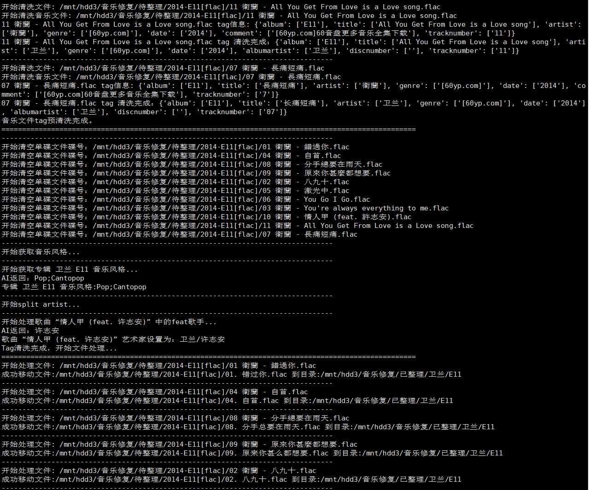

# FLAC音乐tag清洗工具  
   

### 使用方法
修改`SRC_DIR`和`TARGET_DIR`，运行脚本进行音乐Tag清洗

### 功能列表  
1. 清洗被整理的目录内FLAC音乐文件，移动到目标目录，并根据tag信息创建 歌手—专辑 子文件夹  
2. 将音乐文件名和tag转成简体中文  
3. 重命名文件名，改为 ”编号-歌曲名.flac“ 或者 ”碟号—音轨号 歌曲名.flac“  
4. 只支持flac格式  

### 注意事项  
  
 1. 如果不想清空源目录，请将`IS_DELETE_SRC_EMPTY_DIR`设置为False
 2. 如果清洗日文歌曲，请将`IS_CC_CONVERT`设置为False
